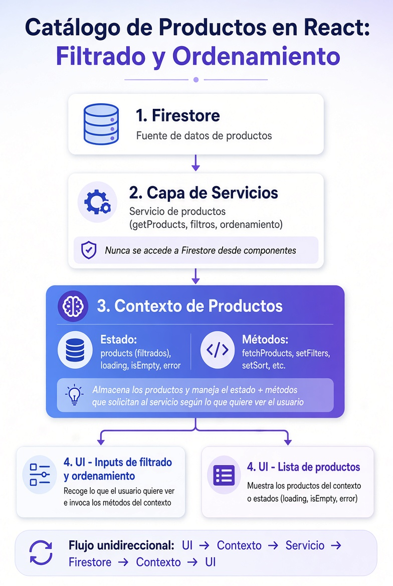

# Products Context

[⬅️ Volver al README](../../README.md)

## 🧩 Flujo de datos y eventos en el manejo de productos

<div style="text-align: center;">
  
</div>

## 📌 Resumen:

1. Firestore → Fuente de los productos
2. Servicio → Única forma de acceder a Firestore (filtros y ordenamiento)
3. Contexto de Productos → Guarda el estado (products, loading, isEmpty, error) y expone los métodos para pedir datos
4. UI (inputs) → El usuario elige filtros/orden y llama a los métodos del contexto
5. UI (lista) → Muestra los productos del contexto o los estados de carga/vacío/error

Todo fluye de forma clara y separada de responsabilidades.

```txt
                ┌────────────────────────────────┐
                │  CartProvider (Componente)     │
                │                                │
                │  Dueño del estado y funciones: │
                │   • cartItems                  │
                │   • addToCart()                │
                │   • removeFromCart()           │
    ╔═══════════│   • clearCart()                │══════════╗
    ║           └──────────────┬─────────────────┘          ║
    ║                          │      CartContext           ║
    ║                          ▼                            ║
    ║                  ┌───────────────┐                    ║
    ║                  │      App      │                    ║
    ║                  └───────┬───────┘                    ║
    ║                          │                            ║
    ║        ┌─────────────────┼────────────────┐           ║
    ║        │                 │                │           ║
    ║        ▼                 ▼                ▼           ║
    ║  ┌──────────────┐  ┌─────────────┐  ┌──────────────┐  ║
    ║  │    Header    │  │ ProductList │  │ FavoriteList │  ║
    ║  └──────────────┘  └─────────────┘  └──────────────┘  ║
    ╚═══════════════════════════════════════════════════════╝
              ▲                 ▲                ▲
              │                 │                │
          useCart()         useCart()        useCart()
              │                 │                │
              └─────────────────┼────────────────┘
                                │
                            🪝 HOOK


  ┌─────────────────────────────────┐     ┌──────────────────────┐     ┌────────────────────┐     ╔═════════════╗
  │     UI (Interfaz de Usuario)    │ <-> │ Contextos / Estados  │ <-> │ Servicios          │ <-> ║  Firestore  ║
  │ Presentacionales / Contenedores │     │                      │     │                    │     ║             ║
  └─────────────────────────────────┘     └──────────────────────┘     └────────────────────┘     ╚═════════════╝
   
   Mostrar Datos                           Guardar Datos (Front)        Solicitar Datos            Guardar Datos (BBDD)
 
   Category: Monitors                        products: [ monitors ]
                                             loading: false
   Prefix: ASUS                              error: "Este es el error"
                                             category: monitors
                                             prefix: ASUS
                                             lastDoc: producto3
                                             hasMore: false

Firestore: Colección Desordenada

1 2 3 4 5 6 7 8 
            | | |
                cursor
```

---

[⬅️ Volver al README](../../README.md)
